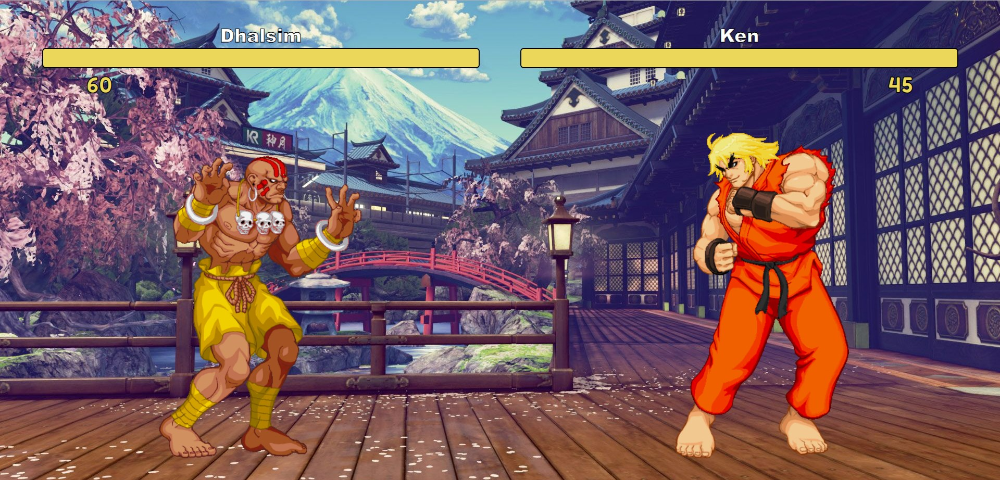

# Street Fighter

## 🏃‍♂️ Simple start

1. **`npm install`** at the root
2. **`npm run start`** at the root
3. open **`http://localhost:9000/`**

## 💡 PS

The project has a [Prettier](https://prettier.io/) set up, so use it to format the code

